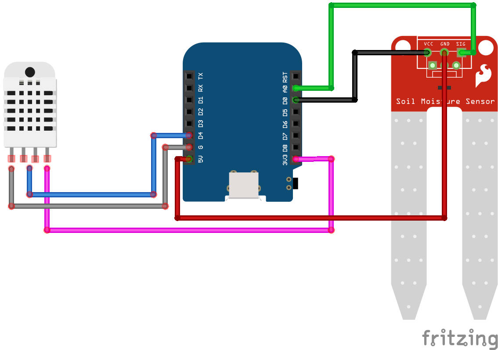

# M290 sensor code

## Setup

* Open the Arduino Studio preferences, and add `http://arduino.esp8266.com/stable/package_esp8266com_index.json,https://dl.espressif.com/dl/package_esp32_index.json,https://github.com/stm32duino/BoardManagerFiles/raw/main/package_stmicroelectronics_index.json` to the "additional board URLs".
* Change the board type to "LOLIN(WEMOS) D1 R2 & mini"

## Required libraries

* [WiFiManager by tzapu/tablatronix](https://github.com/tzapu/WiFiManager)
* [DHT sensor library by Adafruit](https://github.com/adafruit/DHT-sensor-library)
* [OLED SSD1306 by ThingPulse](https://github.com/ThingPulse/esp8266-oled-ssd1306)

## Wiring

